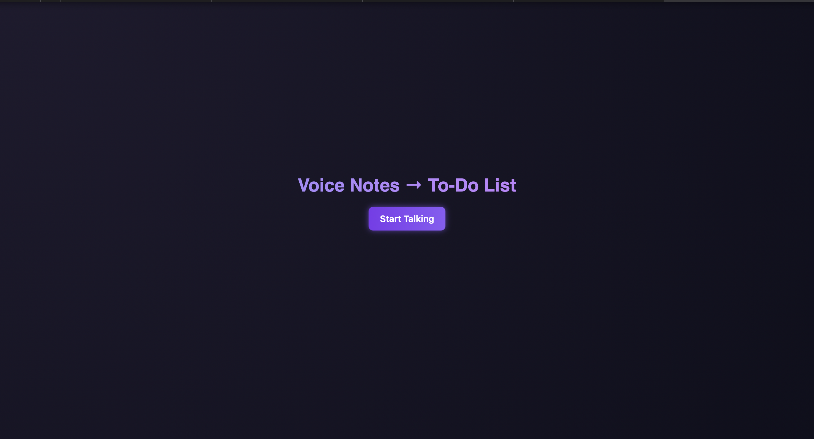
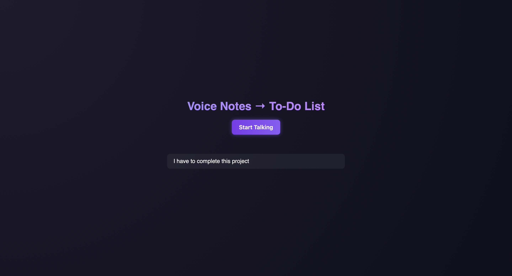
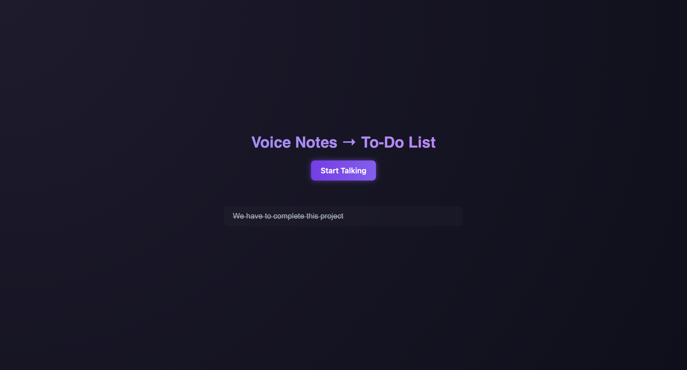

 Voice Notes to To-Do List
============================

A voice-powered to-do app that turns your speech into actionable tasks. Just speak your task, and it gets added instantly to the list — hands-free!

 Features
-----------

*    Dynamically adds spoken tasks to the list
    
*    Click to mark tasks as complete
    

 Setup Instructions
----------------------

### 1\. Clone the repository

Plain textANTLR4BashCC#CSSCoffeeScriptCMakeDartDjangoDockerEJSErlangGitGoGraphQLGroovyHTMLJavaJavaScriptJSONJSXKotlinLaTeXLessLuaMakefileMarkdownMATLABMarkupObjective-CPerlPHPPowerShell.propertiesProtocol BuffersPythonRRubySass (Sass)Sass (Scss)SchemeSQLShellSwiftSVGTSXTypeScriptWebAssemblyYAMLXML`   bashCopyEditgit clone https://github.com/your-username/voice-notes-todo-app.git  cd voice-notes-todo-app   `

> ⚠️ You can skip this step — the app runs completely in-browser by opening index.html.

 Screenshots + Demo
---------------------
UI

After speaking

To do list

 Tech Stack
-------------

*   HTML + CSS + JavaScript (Frontend)
